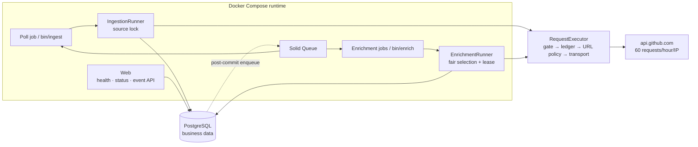

# Design brief — github-push-ingestor

This Rails 8.1 API service polls GitHub's public Events API, stores `PushEvent`
records and their raw payloads in PostgreSQL, and enriches referenced actors and
repositories without a token. The README is the runbook; the [ADRs](adr/) and
[`IMPLEMENTATION_PLAN.md`](../IMPLEMENTATION_PLAN.md) hold the detailed arguments and
execution history.

## Business problem and constraint

The assignment asks for durable ingestion, enrichment, and restart safety. The difficult
constraint is the source: `/events` is a sliding window with documented delivery latency,
and unauthenticated callers share 60 requests per hour per outbound IP — an event can
leave the window unobserved, and enrichment demand can exceed the remaining budget by
orders of magnitude. Event capture is therefore an observable, bounded sample rather than
a mirror. Enrichment is different: every never-enriched entity remains durable work, even
when the backlog cannot drain within a bounded time.

## Architecture, data, and durability



Every outbound call passes through `Github::RequestExecutor`. A global session advisory
lock serializes reservation and execution so the singleton budget ledger cannot race
itself; polling also holds a per-source advisory lock for its whole cycle (the only valid
order is source lock, then gate), and enrichment takes only the gate. Web routes have no
path to the executor, so `/health/*` and `/status` cannot spend budget.

PostgreSQL is the system of record. Seven business tables hold source/run state,
`push_events`, shared actor and repository state, quarantined payloads, and the global
budget ledger; Solid Queue uses a second database in the same server. Raw payloads are
`jsonb` — JSON meaning, not byte layout — and quarantine identity is a canonical-payload
SHA-256, since malformed data may lack a usable event ID.

Acceptance occurs when a `push_events` row commits. Inserts use
`ON CONFLICT (github_event_id) DO NOTHING RETURNING id`. A duplicate observation cannot
create a second event row, and entity activity is updated only when `RETURNING` yields a
new row. A replay may still refresh permitted identity fields.
These invariants are deliberately narrow: executions, runs, quarantine counts, budget
debits, and logs can repeat.

Work committed before a crash remains durable. Advisory locks disappear with their
sessions, entity leases expire by timestamp, and a reconciler rebuilds missing enrichment
work from committed entity rows — the cross-database enqueue is a hint, not the durability
boundary. Work lost before commit is recoverable only while the event remains in a later
feed response; leaving the window is an acknowledged loss mode. This is not
exactly-once execution ([ADR 0005](adr/0005-at-least-once-with-idempotent-writes.md),
[ADR 0008](adr/0008-post-commit-enqueue-and-entity-scoped-reconciliation.md)).

## Request budget and the `304` finding

The hourly allocation is derived rather than guessed:

```text
poll_allowance = ceil(3600 / POLL_INTERVAL_SECONDS)
                 × MAX_PAGES_PER_POLL × enabled_live_source_count
enrichment_allowance = rate_limit - RATE_LIMIT_RESERVE - poll_allowance
actor_guarantee = floor(enrichment_allowance × ACTOR_ENRICHMENT_SHARE)
repository_guarantee = enrichment_allowance - actor_guarantee
```

With defaults: 12 poll attempts, a reserve of 8, and 40 enrichment attempts split 20/20;
startup rejects configurations that leave no enrichment allowance, and the live source
count is read from in-service rows at window initialization
([ADR 0004](adr/0004-class-aware-budget-ledger.md),
[ADR 0009](adr/0009-runtime-source-allocation-and-shared-ip-observability.md)).

GitHub's endpoint documentation broadly describes `304` responses as free, but its REST
best-practices guidance scopes that to correctly authorized requests — and a dated
unauthenticated [probe](evidence/2026-07-30-unauthenticated-304-quota-probe.md) observed
`x-ratelimit-used` increase across a `304`. This system therefore debits every conditional
request: ETags save bandwidth, not budget. The asymmetry decides it — a wrongly-free `304`
can exhaust the shared window, while a wrongly-charged one costs only local opportunity.

## Durable, fair, and safe enrichment

One observed page held roughly 180 distinct entities — a cold-demand pressure scenario,
not a measured unique arrival rate, because identities deduplicate into shared rows.
Defaults reserve 12 attempts for polls, 40 for the enrichment class, and 8 for safety;
durable FIFO backlog has priority over refresh within the 40. Quota exhaustion only defers
rows. If unique arrivals exceed service, backlog size and age can grow without a bounded
completion time.

`/status` exposes per-class count, oldest pending timestamp/age, and allowance usage; it
omits an ETA because there is no durable outcome history for an honest rate. The 40 attempts
carry 20/20 actor/repository guarantees with borrowing when the other class has no
claimable work. A selection that observes a never-enriched row suppresses refresh; one
concurrent insert can cross a one-request decision/debit window before the next selection
self-corrects. Selection and leases prevent duplicate work
([ADR 0007](adr/0007-enrichment-fairness-shares-and-borrowing.md)).

Payload, pagination, and redirect URLs are attacker-influenceable, so the SSRF boundary
allows only HTTPS URLs whose host is exactly `api.github.com` — no userinfo, non-default
port, or IP literal; redirects are bounded, revalidated, and separately debited, and
fixture mode fails closed rather than falling back to the network
([ADR 0003](adr/0003-event-source-and-transport-seams.md)).

## Tradeoffs, omissions, and scaling

Each decision has a deliberate, recorded cost: `jsonb` semantic retention loses
whitespace, object-key order, and duplicate keys; session advisory locks need dedicated
lock-ownership observability; at-least-once execution can repeat duplicate work and
non-event side effects; and Solid Queue over Kafka lets PostgreSQL bound queue
throughput and fan-out.

Authentication, object storage, extra entity APIs, Kafka, and a frontend were omitted to
keep the submission focused on correctness at the stated quota. The bottleneck is
upstream allowance, not local throughput: an authenticated budget would drain the durable
backlog faster but would not make upstream event capture complete. Queue capacity and
database contention should be measured before any broker, and the pinned `2022-11-28` API version
revalidated before upgrade.
