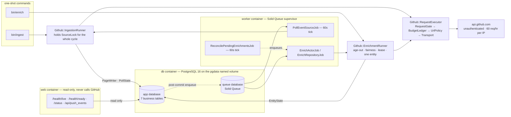
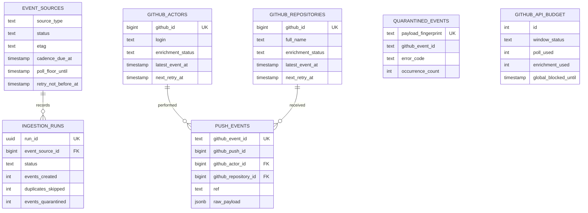

# Design brief — github-push-ingestor

A Rails 8.1 API-only service that polls GitHub's public Events API, persists `PushEvent`
records with their raw payloads in PostgreSQL, and enriches the actors and repositories
they reference — all without a token, inside an unauthenticated ceiling of 60 requests per
hour per IP.

> **The README says how. This brief says why. The ADRs hold the argument; this brief holds
> the decision.**

Two pages is a deliberate budget: the figures and tables carry what prose would otherwise
spend, and every "why" is one sentence plus a link. The execution and traceability artifact
is [`IMPLEMENTATION_PLAN.md`](../IMPLEMENTATION_PLAN.md) — its pre-implementation revision
history lives in Git and in its Appendices A–D, and Appendix E records how the build
diverged from it.

## The problem

GitHub publishes a firehose of public activity at `/events`. The assignment is to ingest
the `PushEvent` slice of it durably, enrich it with actor and repository detail, and
survive restarts.

The hard part is not volume. It is that the source is a **sliding window behind a hard
quota**. The feed retains roughly the last 300 events with a documented 30-second-to-6-hour
delivery latency and a 30-day retention window, and an unauthenticated caller gets 60
requests per hour keyed to its outbound IP — shared with anything else behind that IP.
Every design decision here falls out of that arithmetic: what to poll, how often, what to
enrich, what to admit cannot be done.

So this system is honest about being a **sampler, not a mirror**. It does not claim
complete upstream capture, and it does not claim complete enrichment coverage. What it does
claim, it proves — with a test, a constraint, or a dated transcript.

## Architecture

Two request paths — polling and enrichment — share one executor, and nothing outside that
chain calls GitHub. Polling takes a per-source advisory lock; enrichment never does. A
second, global advisory lock makes outbound concurrency exactly one, application-wide, so
the budget ledger is never racing itself. The lock order (source, then gate, never the
reverse) is enforced at runtime by `Github::LockOrder`, not merely documented.



Every path to GitHub funnels through one `RequestExecutor` node — that single arrow is the
whole rate-limit design. The `web` container has no arrow to GitHub at all, which is why
`/status` and `/health/*` can never spend budget: it is structural, not a promise.

## Data model

Seven business tables in three groups: source and run state (`event_sources`,
`ingestion_runs`), business records (`push_events`, `github_actors`,
`github_repositories`, `quarantined_events`), and one global ledger (`github_api_budget`).
Raw payloads are `jsonb` and retention is **semantic, not byte-exact** — content-equivalent
to what GitHub sent, with whitespace and key order lost and array order preserved
([ADR 0001](adr/0001-jsonb-semantic-retention.md)). Enrichment state lives on the shared
entity rows rather than per-event, because a thousand events referencing one actor are one
enrichment obligation, not a thousand.



The two tables with no edges are the point. `quarantined_events` has no foreign key because
a malformed event may be malformed *precisely because* it lacks the field a key would
reference — its identity is `payload_fingerprint` alone, a SHA-256 of compact UTF-8 JSON
with recursively sorted keys. `github_api_budget` is a `CHECK (id = 1)` singleton because
the unauthenticated quota is keyed to the outbound IP, not to a source. Note also that
`push_events`' foreign keys target `github_id`, GitHub's own identifier, not the surrogate
primary key.

## The durability boundary

**An event is accepted when its `push_events` row commits** — not when GitHub returns it,
not when a job is enqueued, not when a log line says so. Everything upstream of that commit
is retryable; everything downstream is derived.

```text
At-least-once execution
+ Idempotent writes
+ Unique constraints
= Effectively-once persisted outcomes
```

That is a database guarantee, not an application convention. `push_events` inserts with
`ON CONFLICT (github_event_id) DO NOTHING RETURNING id`, and entity activity updates happen
**only when `RETURNING` produced a row** — so a duplicate replay may refresh identity
fields but registers no activity and can never reactivate an entity a budget skip had
terminated. Transactions are per event, not per page, so one malformed envelope cannot
discard the events persisted beside it ([ADR 0005](adr/0005-at-least-once-with-idempotent-writes.md)).

Restart safety needs no cleanup path because nothing needs cleaning. Session advisory locks
die with their session, so a crashed poller releases its source the moment its connection
drops. Entity leases are a `next_retry_at` timestamp that expires by arithmetic rather than
a lock someone must release. Pending enrichment work is the state of committed entity rows,
so `enqueue_after_transaction_commit` makes the enqueue a *hint* and an entity-scoped
reconciler rebuilds the work list from committed state every 60 seconds
([ADR 0008](adr/0008-post-commit-enqueue-and-entity-scoped-reconciliation.md)). Docker's
`restart: unless-stopped` handles the container. **This is not exactly-once execution and
the system never claims it is** — a job may run twice, and the second run changes nothing.

## The request budget, and the 304 finding

One derived formula, never a configured number:

```text
poll_attempt_allowance = ceil(3600 / POLL_INTERVAL_SECONDS)
                         × MAX_PAGES_PER_POLL × ENABLED_LIVE_SOURCE_COUNT
enrichment_allowance   = rate_limit − RATE_LIMIT_RESERVE − poll_attempt_allowance
actor_guarantee        = floor(enrichment_allowance × ACTOR_ENRICHMENT_SHARE)
repository_guarantee   = enrichment_allowance − actor_guarantee
```

| `MAX_PAGES_PER_POLL` | Poll allowance | Enrichment allowance | Actor / repository guarantee |
|---|---|---|---|
| 1 (default) | 12 | 40 | 20 / 20 |
| 2 | 24 | 28 | 14 / 14 |
| 3 | 36 | 16 | 8 / 8 |

Against a limit of 60 with a reserve of 8. The process **refuses to boot** if polling would
leave no capacity for enrichment ([ADR 0004](adr/0004-class-aware-budget-ledger.md)).

**The `304` finding.** GitHub's endpoint documentation contains a general statement that
`304` responses do not affect the rate limit, while its REST best-practices documentation
limits that exemption to correctly authorized requests. Dated unauthenticated probes showed
`x-ratelimit-used` increasing across a `304`. This implementation therefore budgets
unauthenticated conditional requests as one request. The asymmetry decides it: budgeting a
free `304` wastes one attempt an hour, while not budgeting a charged one overruns a
60-request window and blocks everything. ETag remains a bandwidth and correctness measure
here, never a quota saver. The transcript is the argument —
[`docs/evidence/2026-07-30-unauthenticated-304-quota-probe.md`](evidence/2026-07-30-unauthenticated-304-quota-probe.md).

## Enrichment is a bounded sample

One observed live page held ~92–95 `PushEvent` records with ~89 distinct actors and ~92
distinct repositories. That is 181 cold entity requests per page, ~2,172 an hour at twelve
polls, against **40 available** — roughly 1.8% theoretical cold coverage. Partial coverage
is therefore the design, not a shortfall, and `skipped_budget` is a normal documented
outcome rather than a failure state.

Repository candidates alone exceed the whole hourly allowance, so a naive repo-first policy
would starve actor enrichment to zero indefinitely — which Story 3 forbids. Hence per-class
guarantees with **eligibility-aware borrowing**: a class may spend past its guarantee only
when the other has no *currently eligible* candidate, and the ledger enforces the
arithmetic the fairness policy proposes, so a wrong answer produces a refused reservation
rather than an overspend ([ADR 0007](adr/0007-enrichment-fairness-shares-and-borrowing.md)).
Unbounded backlog growth is answered by three mechanisms together: an eligibility window
past which a candidate ages into `skipped_budget`, `skipped_budget` as a terminal state
that no retry sweeps back, and reactivation **only** on a genuinely new push event. The
backlog is bounded by construction, and `/status` publishes the real sampling rate so an
operator sees a sample rather than a mysteriously growing queue.

Enrichment URLs arrive inside GitHub payloads, `Link` headers, and `Location` headers —
attacker-influenceable data — so the SSRF boundary is strict: HTTPS only, host exactly
`api.github.com`, no userinfo, no non-default port, no IP literals, and bounded redirects
each re-validated and separately debited. Every URL is rebuilt from validated components,
and the allowed host is a frozen constant rather than an environment variable, because a
deployment setting there would make the trust boundary configurable. Fixture mode fails
closed: an unknown URL is an error, never a live fallback
([ADR 0003](adr/0003-event-source-and-transport-seams.md)).

## Tradeoffs and assumptions

| Decision | Cost accepted | Record |
|---|---|---|
| `jsonb` semantic retention, not byte-exact | Whitespace, key order, and duplicate keys are lost | [ADR 0001](adr/0001-jsonb-semantic-retention.md) |
| Session advisory locks over `FOR UPDATE` row claims | Lock state is invisible to `SELECT`; needs its own observability | [ADR 0002](adr/0002-advisory-locks-and-request-gate.md) |
| At-least-once execution over exactly-once | Non-idempotent side effects repeat; duplicate work is spent work | [ADR 0005](adr/0005-at-least-once-with-idempotent-writes.md) |
| Five decomposed scheduling columns over one `next_poll_at` | More state to reason about; `next_poll_at` is a cache, never an input | [ADR 0006](adr/0006-decomposed-poll-deferral-state.md) |
| Fairness guarantees with borrowing, not hard caps | A borrowing class can consume the window when the other is idle | [ADR 0007](adr/0007-enrichment-fairness-shares-and-borrowing.md) |
| Solid Queue in a second database, not Kafka | Queue throughput bounded by PostgreSQL; no cross-service fan-out | [ADR 0012](adr/0012-solid-queue-over-kafka.md) |

The load-bearing assumption is that the bottleneck is upstream quota rather than local
throughput. It holds at 60 requests an hour and would need re-examining at 5,000.

## What was deliberately not built

**Extension C (object storage) was not attempted** — a decision, not an oversight. The
remaining budget went to rate-limit correctness, durability, and reviewer experience, which
carry more signal than a fourth extension.

**No authentication.** The 60-requests-per-hour ceiling is the entire design constraint;
removing it would remove the problem this submission is actually about.

**No guarantee of complete upstream capture** and **no guarantee of complete enrichment
coverage.** Both are arithmetic consequences stated in the README's known limitations, not
gaps to be closed later.

**No `/api/actors/:id`, `/api/repositories/:id`, or `/api/ingestion_runs`** — listed as
optional in the plan and left unbuilt rather than half-built.

## Scaling path

**An authenticated token does not tune the enrichment story; it deletes it.** At 5,000
requests an hour, sampling becomes coverage, `skipped_budget` becomes a bug rather than a
state, and the fairness shares become an accounting curiosity. That is also the point where
Solid Queue's throughput ceiling starts to matter and where a broker would first earn its
place. The seams are already in place: `ENABLED_LIVE_SOURCE_COUNT` and runtime source
allocation ([ADR 0009](adr/0009-runtime-source-allocation-and-shared-ip-observability.md))
mean adding a second event source is configuration plus one adapter, not a redesign.

The API version is pinned to `2022-11-28` because every live probe behind this design ran
under it. Upgrading to `2026-03-10` is a deliberate follow-up gated on re-verifying payload
shape and re-running the `304` probe first — not on the version being available
([ADR 0011](adr/0011-pinned-api-version-2022-11-28.md)).

## Where the detail lives

| Artifact | What it holds |
|---|---|
| [`README.md`](../README.md) | How to run, verify, inspect, and reset it |
| [`IMPLEMENTATION_PLAN.md`](../IMPLEMENTATION_PLAN.md) | Execution and traceability; revision history in Appendices A–D, execution summary in E |
| [`docs/adr/`](adr/) | Twelve decisions, each with its context, cost, and consequences |
| [`docs/evidence/`](evidence/) | Dated first-party verifications of contested claims |
