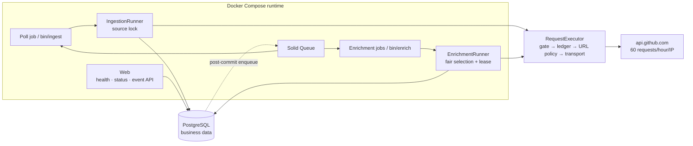

# Design brief — github-push-ingestor

This Rails 8.1 API service samples GitHub's public Events API, stores `PushEvent`
records and their raw payloads in PostgreSQL, and enriches referenced actors and
repositories without a token. The README is the runbook; this brief explains the
decisions. Detailed arguments live in the [ADRs](adr/), and execution history lives in
[`IMPLEMENTATION_PLAN.md`](../IMPLEMENTATION_PLAN.md).

## Business problem and constraint

The assignment asks for durable ingestion, enrichment, and restart safety. The difficult
constraint is the source: `/events` is a sliding window with documented delivery latency,
while unauthenticated callers share 60 requests per hour per outbound IP. An event can
leave the window before this service observes it, and enrichment demand can exceed the
remaining budget by orders of magnitude. The product is therefore an observable,
bounded sampler, not a mirror. It makes no guarantee of complete upstream capture or
complete enrichment.

## Architecture, data, and durability



Every outbound call passes through `Github::RequestExecutor`. A global session advisory
lock serializes request reservation and execution, so the singleton budget ledger cannot
race itself. Polling also holds a per-source advisory lock for its whole cycle; the only
valid order is source lock, then request gate. Enrichment takes only the gate. Web routes
have no path to the executor, so `/health/*` and `/status` cannot spend GitHub budget.

PostgreSQL is the system of record. Seven business tables hold source/run state,
`push_events`, shared actor and repository state, quarantined payloads, and the global
budget ledger; Solid Queue uses a separate database in the same server. Raw payloads use
`jsonb`, preserving JSON meaning rather than byte layout. Quarantine identity is a
canonical-payload SHA-256 because malformed data may have no usable GitHub event ID.

Acceptance occurs when a `push_events` row commits. Inserts use
`ON CONFLICT (github_event_id) DO NOTHING RETURNING id`. A duplicate observation cannot
create a second event row, and entity activity or `skipped_budget` reactivation occurs only
when `RETURNING` yields a new row. A replay may still refresh permitted identity fields.
These are deliberately narrow invariants: executions, ingestion runs, quarantine
occurrence counts, budget debits, and logs can repeat or change.

Work committed before a crash remains durable. Advisory locks disappear with their
sessions, entity leases expire by timestamp, and a reconciler rebuilds missing enrichment
work from committed entity rows, making cross-database enqueue a hint rather than the
durability boundary. Work lost before commit is recoverable only if the event remains in a
later response from the sliding feed; advancing out of that window is an acknowledged loss
mode. This is not exactly-once execution ([ADR 0005](adr/0005-at-least-once-with-idempotent-writes.md),
[ADR 0008](adr/0008-post-commit-enqueue-and-entity-scoped-reconciliation.md)).

## Request budget and the `304` finding

The hourly allocation is derived rather than guessed:

```text
poll_allowance = ceil(3600 / POLL_INTERVAL_SECONDS)
                 × MAX_PAGES_PER_POLL × enabled_live_source_count
enrichment_allowance = rate_limit - RATE_LIMIT_RESERVE - poll_allowance
actor_guarantee = floor(enrichment_allowance × ACTOR_ENRICHMENT_SHARE)
repository_guarantee = enrichment_allowance - actor_guarantee
```

With the defaults, polling receives 12 attempts, the reserve is 8, and enrichment receives
40 attempts split 20/20. Startup rejects configurations leaving no enrichment allowance.
The source count comes from enabled in-service rows at window initialization, with the
configured count as a boot-time fallback ([ADR 0004](adr/0004-class-aware-budget-ledger.md),
[ADR 0009](adr/0009-runtime-source-allocation-and-shared-ip-observability.md)).

GitHub's endpoint documentation broadly describes `304` responses as free, while its REST
best-practices guidance scopes that behavior to correctly authorized requests. A dated
unauthenticated probe observed `x-ratelimit-used` increase across a `304`, so this system
debits every unauthenticated conditional request. ETags still save bandwidth but not
budget. Treating a charged response as free risks exhausting the shared window; treating a
free one as charged costs only local opportunity. The [probe transcript](evidence/2026-07-30-unauthenticated-304-quota-probe.md)
records the evidence.

## Bounded, fair, and safe enrichment

One observed page contained about 90 distinct actors and 90 repositories: roughly 180 cold
lookups competing for 40 hourly attempts. Candidates therefore age from `pending` to the
terminal `skipped_budget` state after an eligibility window. Only a newly inserted push
event can reactivate a skipped entity. This bounds actionable backlog while `/status`
reports pending, skipped, and sampled proportions.

Each entity class receives a guaranteed share. A class may borrow beyond it only when the
other has no currently eligible candidate; the ledger independently refuses invalid
reservations. Never-enriched candidates precede stale refreshes, and selection plus leases
prevents concurrent duplicate work. This keeps a repository-heavy feed from starving actor
enrichment without wasting an idle share ([ADR 0007](adr/0007-enrichment-fairness-shares-and-borrowing.md)).

Payload, pagination, and redirect URLs are attacker-influenceable. The SSRF boundary allows
only HTTPS URLs whose host is exactly `api.github.com`, with no userinfo, non-default port,
or IP literal. Redirects are bounded, revalidated, and separately debited. Fixture mode
fails closed on an unknown URL and never falls back to the network
([ADR 0003](adr/0003-event-source-and-transport-seams.md)).

## Tradeoffs, omissions, and scaling

| Decision | Deliberate cost |
|---|---|
| `jsonb` semantic retention | Whitespace, object-key order, and duplicate keys are lost |
| Session advisory locks | Lock ownership needs dedicated observability |
| At-least-once job execution | Duplicate work and non-event side effects may repeat |
| Solid Queue over Kafka | PostgreSQL bounds queue throughput and fan-out |

Authentication, object storage, extra entity APIs, Kafka, and a frontend were omitted to
keep the submission focused on correctness at the stated quota. The current bottleneck is
upstream allowance, not local throughput. A larger authenticated budget could materially
increase feasible coverage, but would not establish complete capture or enrichment: feed
window loss, failures, demand, and shared-budget effects still apply. At higher sustained
throughput, queue capacity, database contention, and source partitioning should be measured
before introducing a broker. The API version remains pinned to `2022-11-28`; any upgrade
must revalidate payloads, redirects, headers, and `304` accounting first.
