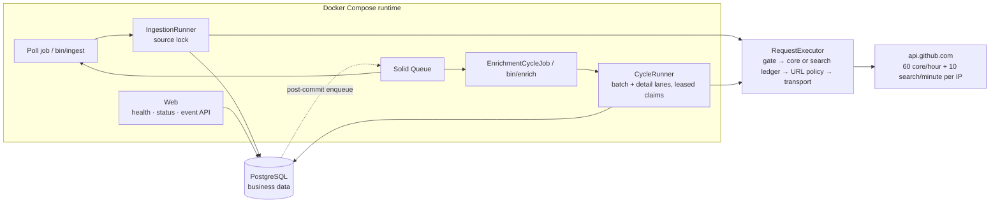

# Design brief — github-push-ingestor

This Rails 8.1 API service polls GitHub's public Events API, stores `PushEvent`
records and their raw payloads in PostgreSQL, and enriches referenced actors and
repositories without a token. The README is the runbook; the [ADRs](adr/) and
[`IMPLEMENTATION_PLAN.md`](../IMPLEMENTATION_PLAN.md) hold the detailed arguments and
execution history.

## Business problem and constraint

The assignment asks for durable ingestion, enrichment, and restart safety. The difficult
constraint is the source: `/events` is a sliding window with documented delivery latency,
and unauthenticated callers share 60 requests per hour per outbound IP — an event can
leave the window unobserved, and enrichment demand can exceed the remaining budget by
orders of magnitude. Event capture is therefore an observable, bounded sample rather than
a mirror. Enrichment is different: every never-enriched entity remains durable work, even
when the backlog cannot drain within a bounded time.

## Architecture, data, and durability



Every outbound call passes through `Github::RequestExecutor`. A global session advisory
lock serializes reservation and execution so the singleton budget ledger cannot race
itself; polling also holds a per-source advisory lock for its whole cycle (the only valid
order is source lock, then gate), and enrichment takes only the gate. Web routes have no
path to the executor, so `/health/*` and `/status` cannot spend budget.

PostgreSQL is the system of record. Ten business tables hold source/run state,
`push_events`, shared actor and repository projections, append-only enrichment
observations, per-request batch envelopes, quarantined payloads, and the two budget
ledgers (hourly core, per-minute search); Solid Queue uses a second database in the same
server. Raw payloads are `jsonb` — JSON meaning, not byte layout — and quarantine
identity is a canonical-payload SHA-256, since malformed data may lack a usable event ID.

Acceptance occurs when a `push_events` row commits. Inserts use
`ON CONFLICT (github_event_id) DO NOTHING RETURNING id`. A duplicate observation cannot
create a second event row, and entity activity is updated only when `RETURNING` yields a
new row. A replay may still refresh permitted identity fields.
These invariants are deliberately narrow: executions, runs, quarantine counts, budget
debits, and logs can repeat.

Work committed before a crash remains durable. Advisory locks disappear with their
sessions, entity leases expire by timestamp, and a reconciler rebuilds missing enrichment
work from committed entity rows — the cross-database enqueue is a hint, not the durability
boundary. Work lost before commit is recoverable only while the event remains in a later
feed response; leaving the window is an acknowledged loss mode. This is not
exactly-once execution ([ADR 0005](adr/0005-at-least-once-with-idempotent-writes.md),
[ADR 0008](adr/0008-post-commit-enqueue-and-entity-scoped-reconciliation.md)).

## Request budget and the `304` finding

Two rate-limit resources, two persisted ledgers. The **core** allocation is derived
rather than guessed:

```text
poll_allowance = ceil(3600 / POLL_INTERVAL_SECONDS)
                 × MAX_PAGES_PER_POLL × enabled_live_source_count
feasible ⇔ poll_allowance + RATE_LIMIT_RESERVE
           + CORE_DETAIL_FALLBACK_ALLOWANCE ≤ rate_limit
```

With defaults: 12 poll attempts, 4 detail-fallback attempts split 2/2 by
`ACTOR_ENRICHMENT_SHARE`, and a reserve of 8 — the three lanes fill the limit exactly.
Normal-path enrichment spends the **search** resource instead — a separate singleton
ledger over GitHub's per-minute Search window (ceiling 10, reserve 2, 6-second pacing),
reconciled against its own `x-ratelimit-resource: search` headers. Startup rejects
infeasible core configurations, and the live source count is read from in-service rows at
window initialization ([ADR 0004](adr/0004-class-aware-budget-ledger.md),
[ADR 0009](adr/0009-runtime-source-allocation-and-shared-ip-observability.md),
[ADR 0013](adr/0013-derivation-first-staged-batch-enrichment.md)).

GitHub's endpoint documentation broadly describes `304` responses as free, but its REST
best-practices guidance scopes that to correctly authorized requests — and a dated
unauthenticated [probe](evidence/2026-07-30-unauthenticated-304-quota-probe.md) observed
`x-ratelimit-used` increase across a `304`. This system therefore debits every conditional
request: ETags save bandwidth, not budget. The asymmetry decides it — a wrongly-free `304`
can exhaust the shared window, while a wrongly-charged one costs only local opportunity.

## Durable, staged, and safe enrichment

One observed page held roughly 180 distinct entities — a cold-demand pressure scenario,
not a measured unique arrival rate, because identities deduplicate into shared rows.
Enrichment is derivation-first and staged: ingestion persists event-native identity,
derives locally computable fields, and coalesces demand by stable GitHub ID; the normal
path then batches up to ten repeated exact `user:`/`repo:` Search qualifiers per request
(never `OR`-joined) on the search budget, validating every returned item against its
immutable ID before applying it. Only missing, renamed, mismatched, or contract-invalid
items fall back to their stored payload-provided detail URLs inside the bounded core
allowance. Completion is an explicit useful-data contract per entity — queryable fields
plus the retained raw item, nullable values valid as nulls — not every field GitHub can
return. Quota, pacing, and reserve denials only defer; no entity is ever terminal because
budget ran out. Refreshes ride the same batch path only after both backlogs are exhausted.

Evidence and convenience are split: every raw item lands in an append-only observation
table with fingerprint, provenance, and validation outcome, and every request attempt in
a batch envelope with counts and observed headers, while entity rows stay the latest
projection pointing at their latest observation — a refresh repoints, never overwrites.
`/status` publishes per-stage backlog, batch fill ratios, measured arrival and completion
rates, and a tri-state catch-up verdict; when completions do not exceed arrivals it says
`not_keeping_up` rather than promising eventual catch-up, and it still publishes no ETA
([ADR 0007](adr/0007-enrichment-fairness-shares-and-borrowing.md),
[ADR 0013](adr/0013-derivation-first-staged-batch-enrichment.md)).

Enrichment URLs have two origins: Search URLs are application-built constants over stored
identifiers, while detail URLs are payload-supplied and attacker-influenceable — so the
SSRF boundary allows only HTTPS URLs whose host is exactly `api.github.com` — no
userinfo, non-default port, or IP literal; redirects are bounded, revalidated, and
separately debited; a Search miss never constructs a detail URL from an identifier; and
fixture mode fails closed rather than falling back to the network
([ADR 0003](adr/0003-event-source-and-transport-seams.md)).

## Tradeoffs, omissions, and scaling

Each decision has a deliberate, recorded cost: `jsonb` semantic retention loses
whitespace, object-key order, and duplicate keys; session advisory locks need dedicated
lock-ownership observability; at-least-once execution can repeat duplicate work and
non-event side effects; and Solid Queue over Kafka lets PostgreSQL bound queue
throughput and fan-out.

Authentication, object storage, extra entity APIs, Kafka, and a frontend were omitted to
keep the submission focused on correctness at the stated quota. The bottleneck is
upstream allowance, not local throughput: an authenticated budget would drain the durable
backlog faster but would not make upstream event capture complete. Queue capacity and
database contention should be measured before any broker, and the pinned `2022-11-28` API version
revalidated before upgrade.
